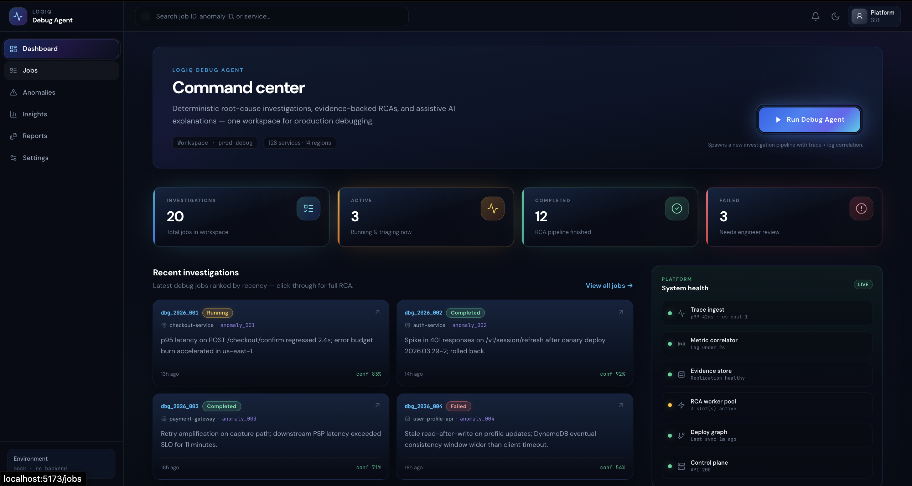
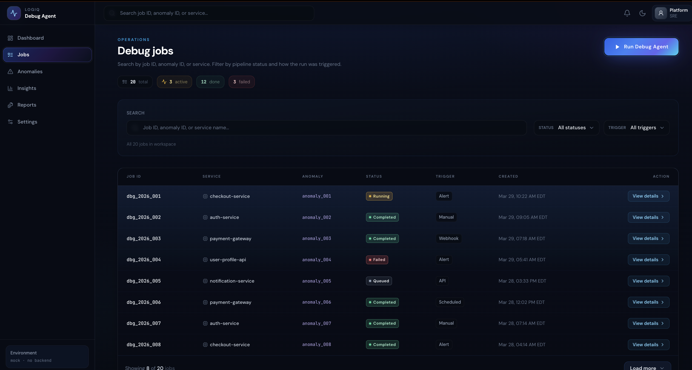
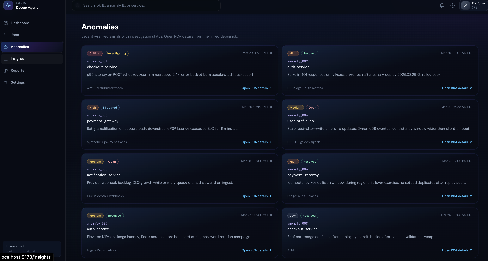
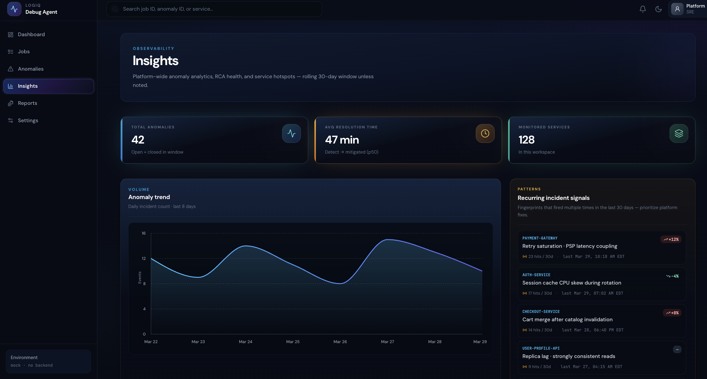
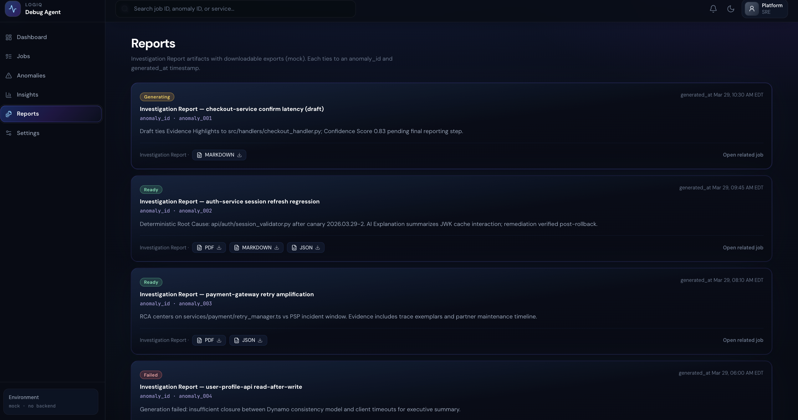

# LogIQ Debug Agent — Frontend

React + Vite UI for the LogIQ debug agent workflow (jobs, investigations, RCA, explanations).

> **Backend is a separate repository.** This app only needs a configurable **API origin**; it does not embed a server URL in source code. Point `VITE_API_BASE_URL` at wherever your API is hosted (local or remote).

## Development

```bash
npm install
npm run dev
```

Open the local URL printed in the terminal (Vite’s default is port `5173`).

```bash
npm run build   # production bundle
npm run preview # serve dist locally
```


## UI screenshots

PNG files live under [`src/assets/`](src/assets/). Paths below are relative to the repo root so images render on GitHub.

### Dashboard



### Jobs



### Anomalies



### Insights



### Reports



---

You can add more captures to `src/assets/` when ready, for example: `job-detail.png`, `utilities.png`, `login.png`, `signup.png`.
